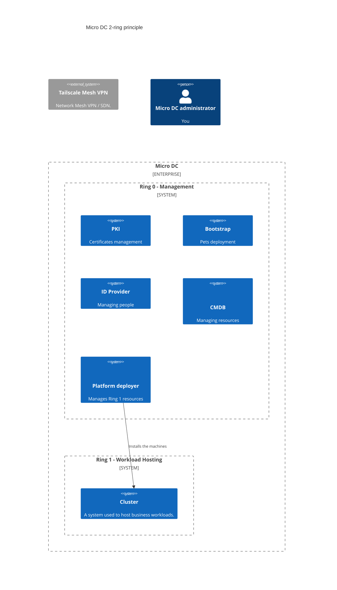

# micro-cloud

**micro-cloud** is a self-hosted home infrastructure organized into trust zones, designed to test and validate cloud-native solutions in a real-world environment.

This project supports a technical article series on Kubernetes, Proxmox, MicroCloud, OpenStack, and more.

## Objectives

- Design a modular and secure cloud platform
- Separate a stable management zone (`ring0`) from an experimental hosting zone (`ring1`)
- Test orchestration, virtualization, containerization, and access control solutions



## Repository Structure

```plaintext
micro-cloud/
├── ring0/         # Low dependency services and core infrastructure (PKI, Netboot, Management)
├── ring1/         # Experimental environments (Kubernetes clusters, etc.)
├── docs/          # Schematics, documentation, articles
├── LICENSE        # Project license (Apache 2.0)
└── README.md      # This file
```

## Physical Architecture

The project relies on a home server rack composed of:

- 1x Deskpi RackMate T2
- 1x Ubiquity Gateway (NAT, SDN, VPN)
- 1x Ubiquity Flex 2.5G Switch
- 1x NUCBox G5 N97 for ring0 (management services)
- 1x NUCBox G5 N97 for ring1 (hosting environments)
- 4 x NUCBox G3 Plus for ring1 (hosting environments)

## Technology Stack

- **Network / VPN:** Tailscale
- **Containerization:** Incus (LXC / KVM)
- **PKI:** cfssl, cert-manager, multirootca
- **Bootstrapping:** kea, matchbox, Talos
- **Orchestration:** Kubernetes, Kamaji, Metal3, Ironic
- **Middleware:** Netbox, Authentik

## Getting Started

### 1. Initialize the headnode (ring0)

On the physical machine with KVM access:

```bash
wget https://raw.githubusercontent.com/mgrzybek/micro-cloud/refs/heads/main/ring0/scripts/init-headnode.sh
chmod +x init-headnode.sh
./init-headnode.sh
```

### 2. Register the headnode as an Incus remote

From your workstation:

```bash
incus remote add headnode-0 headnode-0
incus remote switch headnode-0
```

### 3. Start the bootstrap sequence

Refer to [ring0/README.md](ring0/README.md) for step-by-step operations (PKI, netboot, management node).

## Contributions

Contributions are welcome: bug fixes, documentation, extensions to other rings or orchestration tools.

## License

This project is licensed under Apache 2.0.
