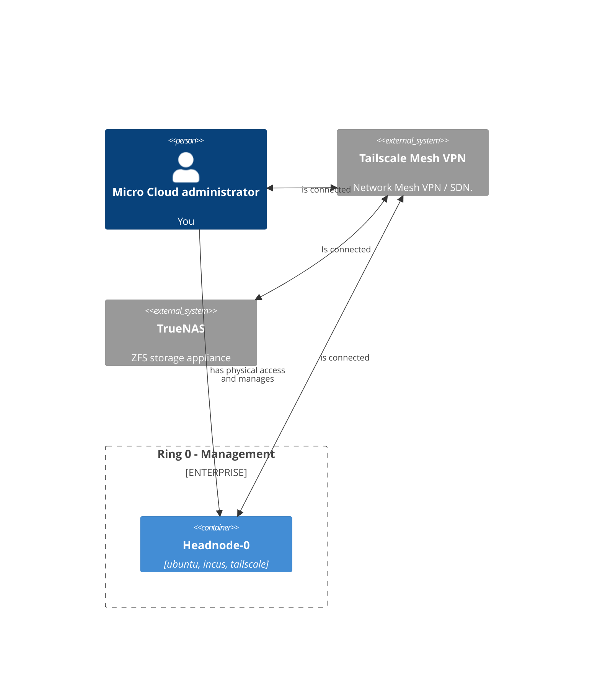
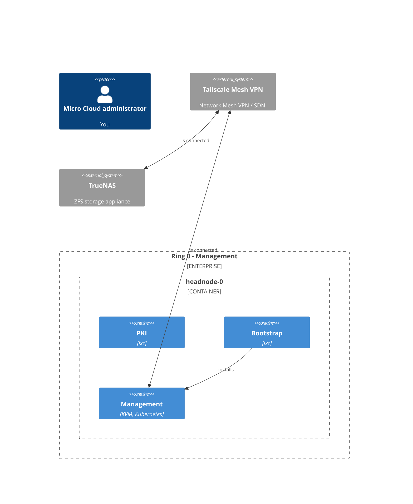
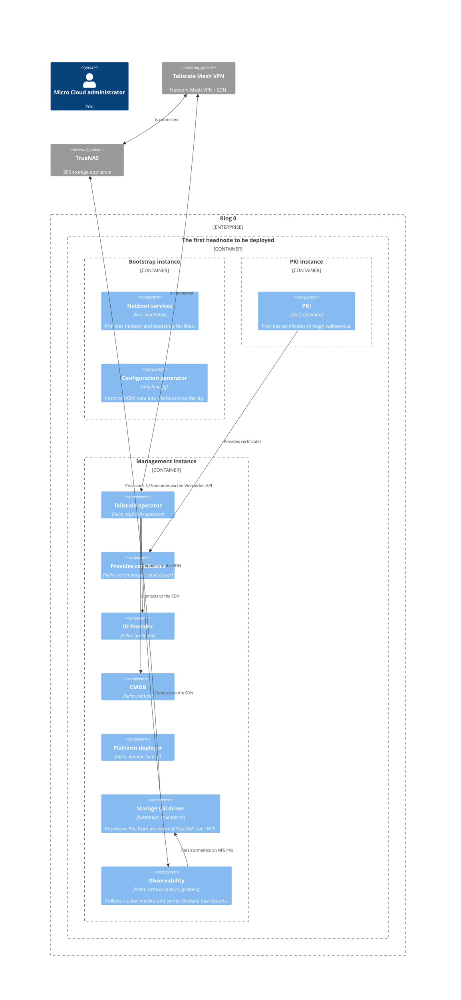
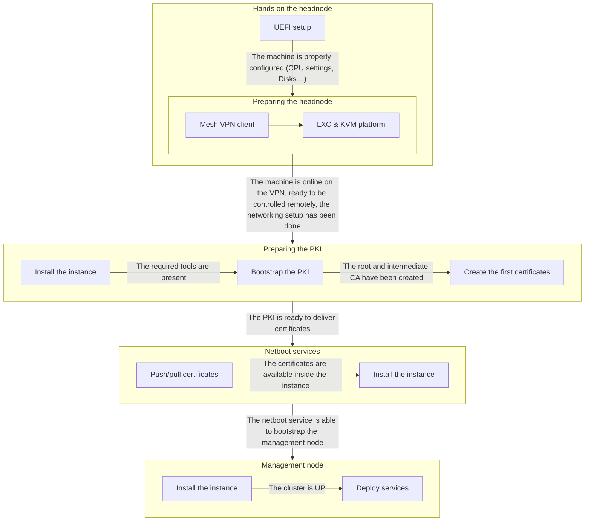
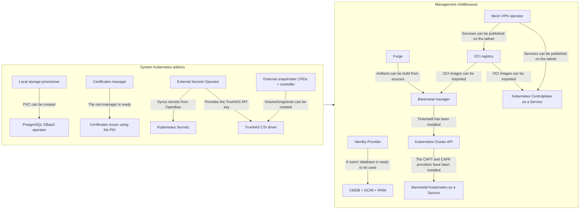

# Pets and core services

## Architecture

### Physical view


```mermaid
C4Container

Person(admin, "Micro Cloud administrator", "You")
System_Ext(mesh, "Tailscale Mesh VPN", "Network Mesh VPN / SDN.")
System_Ext(truenas, "TrueNAS", "ZFS storage appliance")

Enterprise_Boundary(ring0, "Ring 0 - Management") {
    Container(headnode, "Headnode-0", "ubuntu, incus, tailscale")
}

BiRel(mesh, headnode, "is connected")
BiRel(admin, mesh, "is connected")
Rel(admin, headnode, "has physical access<br> and manages")
BiRel(mesh, truenas, "Is connected")

```

### Virtualization view


```mermaid
C4Container

Person(admin, "Micro Cloud administrator", "You")
System_Ext(mesh, "Tailscale Mesh VPN", "Network Mesh VPN / SDN.")
System_Ext(truenas, "TrueNAS", "ZFS storage appliance")

Enterprise_Boundary(ring0, "Ring 0 - Management") {
    Container_Boundary(headnode, "headnode-0") {
        Container(pki, "PKI", "lxc")
        Container(bootstrap, "Bootstrap", "lxc")
        Container(management, "Management", "KVM, Kubernetes")
    }

BiRel(mesh, management, "is connected")
Rel(bootstrap, management, "installs")
BiRel(mesh, truenas, "Is connected")
}
```

### Components view


```mermaid
C4Component

Person(admin, "Micro Cloud administrator", "You")
System_Ext(mesh, "Tailscale Mesh VPN", "Network Mesh VPN / SDN.")

Enterprise_Boundary(ring0, "Ring 0") {
    Container_Boundary(headnode, "The first headnode to be deployed") {
        Container_Boundary(bootstrap, "Bootstrap instance") {
            Component(netboot, "Netboot services", "kea, matchbox", "Provides netboot and bootstrap facilities.")
            Component(machinecfg, "Configuration generator", "machinecfg", "Imports DCIM data into the bootstrap facility.")
        }

        Container_Boundary(pki, "PKI instance") {
            Component(openbao, "PKI", "cfssl, openbao", "Provides certificates through webservice.")
        }

        Container_Boundary(management, "Management instance") {
            Component(tailscale, "Tailscale operator", "helm, tailscale-operator")
            Component(issuer, "Provides certificates", "helm, cert-manager, vault-issuer")
            Component(id, "ID Provider", "helm, authentik")
            Component(dcim, "CMDB", "helm, netbox")
            Component(deployment, "Platform deployer", "helm, kamaji, kamaji")
            Component(csi, "Storage CSI driver", "kustomize, truenas-csi", "Provisions PVs from an external TrueNAS over NFS.")
            Component(observability, "Observability", "helm, victoria-metrics, grafana", "Collects cluster metrics and serves Grafana dashboards.")
        }
    }
}

System_Ext(truenas, "TrueNAS", "ZFS storage appliance")

Rel(openbao, issuer, "Provides certificates")
Rel(tailscale, id, "Connects to the SDN")
Rel(tailscale, dcim, "Connects to the SDN")
Rel(tailscale, observability, "Connects to the SDN")
Rel(observability, csi, "Persists metrics on NFS PVs")
Rel(csi, truenas, "Provisions NFS volumes via the Websocket API")
BiRel(mesh, tailscale, "Is connected")
BiRel(mesh, truenas, "Is connected")

UpdateLayoutConfig($c4ShapeInRow="2", $c4BoundaryInRow="2")
```

## Sequencing

This is the bootstrap's order to create the core services of the platform.


```mermaid
graph
    subgraph offline["Hands on the headnode"]
        uefi["UEFI setup"]
        subgraph prepare["Preparing the headnode"]
            Tailscale["Mesh VPN client"] -->
            Incus["LXC & KVM platform"]
        end
    end

    subgraph pki["Preparing the PKI"]
        init["Install the instance"]       -- The required tools are present -->
        bootstrap_pki["Bootstrap the PKI"] -- The root and intermediate CA have been created -->
        certificates["Create the first certificates"]
    end

    subgraph netboot["Netboot services"]
        cert["Push/pull certificates"] -- The certificates are available inside the instance -->
        bootstrap_netboot["Install the instance"]
    end

    subgraph management["Management node"]
        bootstrap_management["Install the instance"] -- The cluster is UP --> 
        deploy["Deploy services"]
    end

    uefi        -- The machine is properly configured (CPU settings, Disks…) -->
    prepare     -- The machine is online on the VPN, ready to be controlled remotely, the networking setup has been done -->
    pki         -- The PKI is ready to deliver certificates -->
    netboot     -- The netboot service is able to bootstrap the management node -->
    management
```

These are the management services, hosted by the Kubernetes-based management node.


```mermaid
flowchart LR
    subgraph system["System Kubernetes addons"]
        storage["Local storage provisioner"] -- PVC can be created        --> cnpg["PostgreSQL DBaaS operator"]
        cert-manager["Certificates manager"] -- The cert-manager is ready --> cert-issuer["Certificates issuer using the PKI"]
        eso["External Secrets Operator"] -- Syncs secrets from OpenBao --> k8s-secrets["Kubernetes Secrets"]
        snapshotter["External snapshotter CRDs + controller"] -- VolumeSnapshots can be created --> truenas-csi["TrueNAS CSI driver"]
        eso -- Provides the TrueNAS API key --> truenas-csi
    end

    subgraph middlewares["Management middlewares"]
        authentik["Identity Provider"] -- A users' database is ready to be used --> netbox["CMDB + DCIM + IPAM"]
        forge["Forge"] -- Artifacts can be build from sources --> tinkerbell
        zot["OCI registry"] -- OCI images can be imported --> kamaji["Kubernetes Controlplane as a Service"]
        zot -- OCI images can be imported --> tinkerbell["Baremetal manager"] -- Tinkerbell has been installed --> clusterapi["Kubernetes Cluster API"] -- The CAPT and CAPK providers have been installed --> kaas["Baremetal Kubernetes as a Service"]
        tailscale["Mesh VPN operator"] -- Services can be published on the tailnet --> zot
        tailscale["Mesh VPN operator"] -- Services can be published on the tailnet -->  kamaji
    end

    system --> middlewares
```

## Offline task: Preparing the headnode

These actions must be done in front of the headnode, using a KVM (Keyboard, Video, Mouse).  
Let's make the machine join the mesh VPN and install the hosting tooling.

```console
# A one-time script to execute on the machine
headnode$ wget https://raw.githubusercontent.com/mgrzybek/micro-cloud/refs/heads/main/ring0/scripts/init-headnode.sh

# Starting the init script
headnode$ bash ./init-headnode.sh
```

After this task, you should be able to connect against the headnode using Tailscale.

## Activating the remote Incus access

```console
# On the headnode, create a token
headnode$ incus config trust add tailscale

# On your workstation, declare the remote node
workstation$ incus remote add headnode-0 headnode-0
workstation$ incus remote switch headnode-0
```

## Bootstrapping the PKI

These tasks are executed on your workstation, inside the git repository root path.

```shell
# Some attributes are required to create the root CA
export PKI_COUNTRY="FR"
export PKI_LOCATION="Paris"
export PKI_ORG="My Cloud"
export PKI_ORG_UNIT="CA Services"
export PKI_STATE="IDF"

cd ./ring0
task intermediate-fullchain

# The intermediate CA bundle should be present.
cat dist/bundle.crt
```

## Bootstrapping the netboot services

First, we need to create the bootstrap instance and to configure it.  
The `task bootstrap` command will set up the bootstrap instance with the network bridge, VLAN, and physical interface specified, and prepare the Talos artifacts required for deployment. Talos is a Kubernetes-native, minimal OS for managing bare metal clusters (<https://talos.dev>).

```bash
export BRIDGE_BOOTSTRAP_NAME=bootstrapbr0         # Depending on your incus configuration
export BRIDGE_BOOTSTRAP_VLAN=2                    # Depending on your network fabric
export PHYS_IFACE=enp2s0                          # Depending on your machine's configuration
export IFACE_BOOTSTRAP_IPADDR_CIDR=192.168.2.2/24 # Depending on your network fabric

# Talos attributes used to download the artifacts
export TALOS_FACTORY_URL=factory.talos.dev
export TALOS_FACTORY_UUID=11b09aacd770c0df15510e4d0815853404ada5d251a7461a21ab3ef73e1808ca
export TALOS_VERSION=v1.13.0

task bootstrap
```

## Bootstrapping the forge

Let's deployment the forge. It will be used to create custom artifacts later on.

```shell
task forge
```

## Bootstrapping the management node

Let's deploy the management instance. Some variables can be changed if required.

```shell
# In addition to the previous variables, some must be added.
export TS_AUTHKEY=xxxxxx
export TS_OPERATOR_CLIENT_ID=xxxxxx
export TS_OPERATOR_CLIENT_SECRET=xxxxxx

export BRIDGE_SERVICES_NAME=services0
export INSTANCE_MANAGEMENT_BOOTSTRAP_IPADDR_CIDR=192.168.2.3/24

export BRIDGE_SERVICES_NAME=services0
export INSTANCE_MANAGEMENT_SERVICES_IPADDR_CIDR=192.168.3.3/24

export BMAAS_NAMESPACE=bmaas-system

task management
```

## Bootstrapping Flux (GitOps)

After `task management`, bootstrap FluxCD Operator so it takes over all platform workloads.
The script creates the pre-requisite Secrets and the `cluster-config` ConfigMap, then applies the `FluxInstance`.

```shell
# Required variables (add to your variables.sh / environment)
export TS_OPERATOR_CLIENT_ID=xxxxxx
export TS_OPERATOR_CLIENT_SECRET=xxxxxx
export PKI_ENDPOINT=https://pki.<ts_suffix>
export PKI_ORG="My Cloud"
export DNS_IP=192.168.3.7
export HOOKOS_IP=192.168.3.6
export REGISTRY_IP=192.168.3.4
export TINKERBELL_IP=192.168.3.5
export ARTIFACTS_FILE_SERVER=http://<bootstrap-ip>/
export DHCP_BIND_INTERFACE=eth0
export BOOTSTRAP_ENDPOINT=http://<bootstrap-ip>/assets/tinkerbell
export ANNOUNCEMENTS_IFACE=eth1   # interface on management node facing the services VLAN
export GITHUB_ACTOR=<your GitHub username>
export GHCR_TOKEN=<GitHub PAT with read:packages>
export TRUENAS_HOSTNAME=storage   # Tailscale hostname of the TrueNAS appliance
export TRUENAS_POOL=pool1/csi/nfs # Full ZFS dataset path used for CSI volumes

task flux
```

From this point Flux manages the following components from the OCI artifact (`ghcr.io/mgrzybek/micro-cloud`):

| Flux path | Component | Namespace |
| --- | --- | --- |
| `infrastructure/00-prometheus-operator-crds` | `monitoring.coreos.com` CRDs (ServiceMonitor/PodMonitor) | flux-system |
| `infrastructure/01-cilium` | Cilium CNI | kube-system |
| `infrastructure/01-cert-manager` | cert-manager | cert-manager |
| `infrastructure/02-cnpg-operator` | CloudNative PG operator | cnpg-system |
| `infrastructure/02-pg-cluster` | PostgreSQL cluster | platform-management |
| `infrastructure/02-tailscale-operator` | Tailscale Operator | tailscale |
| `infrastructure/02-external-snapshotter` | CSI VolumeSnapshot CRDs + controller | kube-system |
| `infrastructure/03-metrics-server` | metrics-server (`kubectl top` / HPA) | kube-system |
| `apps/03-idp` | Authentik (IDP) | platform-management |
| `apps/04-cmdb` | Netbox (CMDB) | platform-management |
| `apps/04-eso` | External Secrets Operator | external-secrets |
| `apps/05-bmaas/zot` | Zot OCI registry | tinkerbell-system |
| `apps/05-bmaas/kamaji` | Kamaji | kamaji-system |
| `apps/05-bmaas/tinkerbell` | Tinkerbell | tinkerbell-system |
| `apps/05-storage/truenas-csi` | TrueNAS CSI driver | truenas-csi |
| `apps/06-observability/postgres` | Grafana PostgreSQL backend (CNPG) | observability |
| `apps/06-observability/victoria-metrics` | VictoriaMetrics stack + Grafana (metrics only) | observability |

Monitor reconciliation with:

```shell
flux get all -A
```

## Post-Flux setup

### Exposing the IDP service

Once Flux has deployed Authentik, expose it on the tailnet:

```shell
task idp
```

Now you are ready to populate your directory as needed. Please note that Netbox uses two groups by default: `staff` and `superusers`. You have to add some users to these groups to be able to manage Netbox.

If you want to use Authentik's API to provision resources, you should create a token using the admin account at [https://idp.your-tailscale-suffix/if/admin/#/core/tokens).](https://idp/if/admin/#/core/tokens).

### Exposing the CMDB service

The official documentation on how to integrate the SSO mechanism between Authentik and Netbox is [described here](https://integrations.goauthentik.io/documentation/netbox/).

However, some care must be provided concerning the OAuth2/OpenID Provider section. The signing key should be set to the default one but the encryption key must be unselected. The Python module used by Netbox returns errors when trying to decrypt JWT tokens.

```shell
export APPLICATION_SLUG=netbox-cmdb
export CLIENT_ID=xxxxx
export CLIENT_SECRET=xxxxx

task cmdb
```

> [!WARNING]
> Installing Netbox can be quite long because of the database initialization.

### Exposing the Grafana service

The observability stack (VictoriaMetrics + Grafana, metrics only) is deployed by Flux
in the `observability` namespace. Once the `grafana` service exists, expose it on the
tailnet with the same Gateway API + Tailscale pattern used for the IDP and CMDB:

```shell
export PKI_ORG=xxxxx   # same value used when bootstrapping the PKI

task observability
```

This renders `manifests/06-observability/api-gateway.yaml.j2` in two passes (HTTP first to
obtain the tailnet IP, then HTTPS with a cert-manager `Certificate`) and publishes Grafana at
`https://grafana.<ts_suffix>`. The VictoriaMetrics single-node TSDB is persisted on the
`truenas-iscsi` (block) StorageClass — VictoriaMetrics does not support NFS — and Grafana stores
its state in a dedicated CNPG PostgreSQL cluster (`grafana-db`) rather than SQLite. Both PVCs can
be backed up with the `truenas-snapclass` `VolumeSnapshotClass`.

> [!NOTE]
> Logs (VictoriaLogs), traces (VictoriaTraces), alerting (vmalert/Alertmanager) and Grafana SSO
> via Authentik are intentionally out of scope for this iteration and can be added later.

#### Metrics discovery across all middlewares

Every Helm chart that supports it enables its `ServiceMonitor`/`PodMonitor` option (Cilium — agent,
operator, envoy and Hubble —, cert-manager, CloudNativePG operator and both PostgreSQL clusters,
metrics-server, External Secrets, Authentik, Netbox, Zot, Kamaji, Kamaji-etcd and Grafana). The
VictoriaMetrics operator watches these `monitoring.coreos.com` objects cluster-wide and converts them
into its own `VMServiceScrape`/`VMPodScrape` resources, which `vmagent` scrapes
(`selectAllByDefault: true`).

Those CRDs are **not** shipped by the VictoriaMetrics chart — the operator only converts
pre-existing objects — so they are installed early as `infrastructure/00-prometheus-operator-crds`
(chart `prometheus-community/prometheus-operator-crds`). Charts that render a `ServiceMonitor`
inside the `infrastructure` Kustomization (Cilium, cert-manager, CNPG, metrics-server) declare a
`dependsOn` on that release; the `apps` charts are already ordered after `infrastructure` via the
Kustomization `dependsOn`.

### Configuring OIDC for the management cluster

Once Authentik is exposed (`task idp`), you can let the management cluster's `kube-apiserver` authenticate users against it.

1. In the Authentik admin UI, create an OAuth2/OpenID **Provider**:
   - Redirect URI: `http://localhost:8000/callback` (used by `kubectl` via `kubelogin`/`oidc-login`)
   - Scopes: `openid`, `profile`, `email`, `groups`
   - Same signing-key caveat as Netbox: keep the default signing key, unselect the encryption key.
2. Create an **Application** bound to this provider, and note its slug.
3. Create a **group** in Authentik for cluster access (e.g. `k8s-admins`) and add a group mapping to the provider so the `groups` claim is populated.
4. Run the post-configuration task — it patches the live Talos machine config (no cluster reinstall) and creates the matching `ClusterRoleBinding`:

```shell
export OIDC_SLUG=k8s-management
export OIDC_CLIENT_ID=xxxxx
export OIDC_GROUP=k8s-admins
export OIDC_CLUSTER_ROLE=cluster-admin

task configure-oidc
```

5. On the client side, install the `oidc-login` kubectl plugin (`kubectl krew install oidc-login`) and add an `exec`-based user to your kubeconfig pointing at `https://idp.<ts_suffix>/application/o/${OIDC_SLUG}/`, alongside — not replacing — the existing certificate-based `admin@management` context, so you always keep a fallback access path.

### Configuring Tinkerbell

Some pre-configuration is needed to make CoreDNS use Netbox as an IPAM. You must create a `coredns` service account able to read IP addresses from the IPAM section.

```shell
export COREDNS_NETBOX_TOKEN="A 40-character long token"
export REGISTRY_IP=192.168.3.4
export TINKERBELL_IP=192.168.3.5
export HOOKOS_IP=192.168.3.6
export DNS_IP=192.168.3.7

task bmaas
```

### Configuring the TrueNAS CSI driver

The driver's API key is not part of the GitOps repository: it is pulled at
runtime from OpenBao via an `ExternalSecret` (`truenas-csi/truenas-api-credentials`).
Push it once, from inside the `pki` Incus instance — see
[core-services/pki/README.md](core-services/pki/README.md#openbao):

```shell
export VAULT_ADDR=https://<pki-instance-ip>:8200
export VAULT_TOKEN="$(cat dist/openbao-root.token)"
bao kv put secret/truenas-csi api-key=<your-truenas-api-key>
```

The `truenas-csi-config` ConfigMap and the `truenas-nfs` / `truenas-iscsi`
StorageClasses are also excluded from Flux: `truenasURL`/`nfsServer` depend on
`ts_suffix` and `datasetPath` depends on `TRUENAS_POOL`, both resolved only at
deploy time. `task flux` creates them imperatively from
`TRUENAS_HOSTNAME`/`TRUENAS_POOL` (see [deploy-flux.sh](scripts/deploy-flux.sh));
re-run it whenever these values change. `TRUENAS_POOL` must be the full ZFS
dataset path (e.g. `pool1/csi/nfs`), used verbatim as the StorageClass's
`datasetPath` — do not just pass the pool name.

Two StorageClasses are provisioned:

- **`truenas-nfs`** — file storage over NFS, RWX-capable, default for general PVCs.
- **`truenas-iscsi`** — block storage over iSCSI, required by databases and by
  VictoriaMetrics (which does not support NFS). It has two prerequisites:
  1. **TrueNAS**: enable the iSCSI service and a portal reachable at
     `$TRUENAS_HOSTNAME.$TS_SUFFIX:3260` (already wired as `iscsiPortal` in the
     `truenas-csi-config` ConfigMap).
  2. **Talos nodes**: the `siderolabs/iscsi-tools` extension must be baked into
     the installer image. Regenerate the factory image at
     [factory.talos.dev](https://factory.talos.dev) with `iscsi-tools` added to
     the existing extensions (`tailscale`, `lldpd`), update `TALOS_FACTORY_UUID`
     (and `WORKER_TALOS_FACTORY_UUID`), then upgrade the node:

     ```shell
     task upgrade-management   # talosctl upgrade — reboots the (single) node
     ```

     Verify with `talosctl -n <node> get extensions | grep iscsi-tools`.

## Releasing a new version

Push a semver tag to trigger the GitHub Actions workflow that publishes the Flux manifests as an OCI artifact:

```bash
git tag v1.2.3
git push origin v1.2.3
```

Flux picks up the new tag automatically (or pin a specific version in `flux/clusters/management/flux-system/flux-instance.yaml`).

## Day-2: Adding a physical worker node

A physical machine can be added to the management cluster as a worker node via PXE boot through Matchbox.

Each worker requires a dedicated patch file in the gitops repository at:

```text
$GITOPS_ROOT/ring0/workers/<hostname>/patch.yaml
```

This file contains all the static Talos configuration for the machine (network interfaces, VLANs, disk layout, Tailscale key). Two values are injected at runtime via `envsubst`:

- `${INSTALL_IMAGE}` — Talos factory installer URL (built from `TALOS_FACTORY_URL`, `WORKER_TALOS_FACTORY_UUID`, and the cluster's current Talos version)
- `${MGMT_TS_IP}` — management node Tailscale IP (resolved via `tailscale status`)

See [core-services/management/talos/README.md](core-services/management/talos/README.md) for the expected file format.

```shell
# Identity
export WORKER_HOSTNAME=worker1          # Must match the patch file name in gitops
export WORKER_MAC=aa:bb:cc:dd:ee:ff     # MAC address of the NIC on the bootstrap VLAN

# Gitops repository containing the per-machine patch
export GITOPS_ROOT=/path/to/your-gitops-repo

# Talos factory image for this worker
export TALOS_FACTORY_URL=factory.talos.dev
export WORKER_TALOS_FACTORY_UUID=a78ca499dd99112bd2c2730b1b8a50375d8fa3af36f1a10b30a2fa83cc8c0d35

task add-worker
```

The task will:

1. Query the management node's Talos version and Tailscale IP automatically
2. Render the per-machine patch (`envsubst` on `$GITOPS_ROOT/ring0/workers/$WORKER_HOSTNAME/patch.yaml`)
3. Merge the rendered patch on top of `dist/worker.yaml` via `talosctl machineconfig patch`
4. Validate the resulting config with `talosctl validate --mode metal`
5. Download the Talos PXE kernel and initramfs to the bootstrap instance (idempotent)
6. Push the machine config and Matchbox profile/group files to the bootstrap instance
7. Wait for the node to appear as `Ready` in the cluster

Power on the physical machine after launching the task; it will PXE boot and join the cluster automatically.

> [!NOTE]
> `dist/worker.yaml` and `dist/talosconfig` must exist (generated by `task management`).
> The management node's Tailscale IP is resolved automatically at runtime (`tailscale status --json`). A static `/etc/hosts` entry is injected into the worker's machineconfig so the kubelet can reach the API server before Tailscale DNS is fully operational on first boot.
> `yq` must be installed (`brew install yq` / `apt install yq`) — it is used to strip the default `HostnameConfig: auto: stable` generated by Talos before applying the per-machine patch.

## Troubleshooting

Here are some common issues and tips:

- **Unable to connect to headnode via Tailscale after init:**
  Ensure the init-headnode.sh script completed successfully and that your Tailscale auth key is valid and not expired. Check network connectivity and firewall rules. Try pinging your tailnet members using `tailscale ping` command.

- **Bootstrap instance creation fails:**
  Verify your network bridge and VLAN settings are correct and that the physical interface specified is up. Check Incus logs for errors.

- **Certificates not generated during PKI bootstrap:**
  Confirm that `make dist/intermediate-fullchain.pem` runs without error. Verify the presence of the root CA and intermediate CA CSR files in the `pets/ring0/core-services/pki/files` directory.

- **Management services fail to deploy:**
  Ensure that the bootstrap instance is fully operational and accessible. Check that the management instance joins the tailnet using `tailscale ping management`. Check Kubernetes cluster status and the logs of Helm deployments (cert-manager, authentik, netbox, etc.).

- **SSO login fails using Netbox:**
  Check the signing and encryption keys used in the provider section in Authentik.

- **`talosctl validate` reports `'auto' and 'hostname' cannot be set at the same time`:**
  Talos v1.13+ generates a `HostnameConfig: auto: stable` document by default in `talosctl gen config` output. Both `bootstrap-instance.sh` and `add-worker.sh` strip this document with `yq` before applying per-machine patches. If the error appears, verify that `yq` is installed and that the stripping step ran (look for `yq 'select(.kind != "HostnameConfig")'` in the script output).

- **`talosctl validate` reports `UserVolumeConfig min size is greater than max size`:**
  This collision occurs when a `UserVolumeConfig` is present in both the global `dist/patch.yaml` and a per-machine patch. The global patch must contain only `TrustedRootsConfig` (CA bundle). `UserVolumeConfig` belongs in `dist/cp-patch.yaml` (management node, via `patch.yaml.j2`) and in each worker's per-machine patch file.

- **`talosctl validate` reports `static hostname is already set in v1alpha1 config`:**
  The machine config contains both a `HostnameConfig` document and a `machine.network.hostname` field. Since Talos v1.13+, hostname must be set exclusively via `HostnameConfig`. Remove any `machine.network.hostname` entry from patches and use `kind: HostnameConfig` instead.

- **`add-worker` task fails with `Per-machine patch not found`:**
  Create `$GITOPS_ROOT/ring0/workers/$WORKER_HOSTNAME/patch.yaml` in your gitops repository. See [core-services/management/talos/README.md](core-services/management/talos/README.md) for the expected structure.

- **`403 permission denied` when running `bao kv put` against OpenBao:**
  The `eso-secrets` policy used by the ESO AppRole is read-only (`secret/data/*`, capability `read`). Writing a new secret (e.g. `secret/truenas-csi`) requires the root token instead: `export VAULT_TOKEN="$(cat dist/openbao-root.token)"`. See [core-services/pki/README.md](core-services/pki/README.md#openbao).

- **`truenas-csi-controller` / `truenas-csi-node` stuck in `CreateContainerConfigError`:**
  The `truenas-csi-config` ConfigMap is missing or incomplete. It is intentionally excluded from Flux (see the header comment in `flux/apps/05-storage/truenas-csi/configmap.yaml`) because `truenasURL`/`nfsServer` depend on `ts_suffix`; it is created imperatively by `task flux`. Re-run it with `TRUENAS_HOSTNAME` and `TRUENAS_POOL` exported.

- **`ExternalSecret truenas-api-credentials` never syncs (`SecretSyncedError`):**
  Check, in order: the secret was actually pushed to OpenBao (`bao kv get secret/truenas-csi`); OpenBao is not sealed (`dist/openbao-unseal.key`); the store is healthy (`kubectl get clustersecretstore openbao -o yaml`).

- **PVC using `truenas-nfs` stays `Pending` with a pool/dataset error:**
  The `truenas-nfs` StorageClass is created imperatively by `task flux` (excluded from Flux, see `flux/apps/05-storage/truenas-csi/storageclass.yaml`'s header comment) with `datasetPath` set verbatim to `$TRUENAS_POOL` — this must already be the full dataset path (e.g. `pool1/csi/nfs`), not just the pool name, otherwise the driver looks up a duplicated/incorrect path (e.g. `pool1/csi/nfs/csi/nfs`). Confirm `TRUENAS_POOL` matches an existing dataset on the TrueNAS appliance, and that the management cluster can reach `stockage.<ts_suffix>` over Tailscale.

- **General logs and debugging:**
  Use `journalctl` on the bootstrap and pki instances to inspect system services. Use `incus` commands with verbose flags (`-v`) for detailed output. Use `incus console management` to see the console output of the management instance, especially during the boot process.

For more detailed help, visit the documentation and communities of the respective tools:

- [Matchbox](https://matchbox.psdn.io/)
- [Tailscale](https://tailscale.com/kb/)  
- [Talos](https://talos.dev/docs/)  
- [Kamaji](https://kamaji.io/)  
- [Tinkerbell](https://tinkerbell.org/)
- [Cert-manager](https://cert-manager.io/docs/)  
- [Authentik](https://docs.goauthentik.io/docs/install-config/)
- [Netbox](https://netbox.readthedocs.io/en/stable/)  
