# Pets and core services

## Architecture

### Physical view


### Virtualization view


### Components view


## Sequencing

This is the bootstrap's order to create the core services of the platform.

```mermaid
graph
    subgraph offline["Hands on the headnode"]
        uefi["UEFI setup"]
        subgraph prepare["Preparing the headnode"]
            Tailscale["Mesh VPN client"] -->
            Incus["LXC & KVM platform"]
        end
    end

    subgraph pki["Preparing the PKI"]
        init["Install the instance"]       -- The required tools are present -->
        bootstrap_pki["Bootstrap the PKI"] -- The root and intermediate CA have been created -->
        certificates["Create the first certificates"]
    end

    subgraph netboot["Netboot services"]
        cert["Push/pull certificates"] -- The certificates are available inside the instance -->
        bootstrap_netboot["Install the instance"]
    end

    subgraph management["Management node"]
        bootstrap_management["Install the instance"] -- The cluster is UP --> 
        deploy["Deploy services"]
    end

    uefi        -- The machine is properly configured (CPU settings, Disks…) -->
    prepare     -- The machine is online on the VPN, ready to be controlled remotely, the networking setup has been done -->
    pki         -- The PKI is ready to deliver certificates -->
    netboot     -- The netboot service is able to bootstrap the management node -->
    management
```



These are the management services, hosted by the Kubernetes-based management node.


## Offline task: Preparing the headnode

These actions must be done in front of the headnode, using a KVM (Keyboard, Video, Mouse).  
Let's make the machine join the mesh VPN and install the hosting tooling.

```console
# A one-time script to execute on the machine
headnode$ wget https://github.com/mgrzybek/micro-cloud/main/raw/ring0/scripts/init-headnode.sh

# Starting the init script
headnode$ ./init-headnode.sh
```

After this task, you should be able to connect against the headnode using Tailscale.

## Activating the remote Incus access

```console
# On the headnode, create a token
headnode$ incus config trust add tailscale

# On your workstation, declare the remote node
workstation$ incus remote add headnode-0 headnode-0
workstation$ incus remote switch headnode-0
```

## Bootstrapping the PKI

These tasks are executed on your workstation, inside the git repository root path.

```shell
cd ./ring0
make dist/intermediate-fullchain.pem

# Both the intermediate CA and the secret auth key for multirootca should be present.
cat dist/intermediate-fullchain.pem
cat dist/auth.key
```

## Bootstrapping the netboot services

First, we need to create the bootstrap instance and to configure it.  
The `make bootstrap` command will set up the bootstrap instance with the network bridge, VLAN, and physical interface specified, and prepare the Talos artifacts required for deployment. Talos is a Kubernetes-native, minimal OS for managing bare metal clusters (https://talos.dev).

```bash
export BRIDGE_NAME=bootstrapbr0         # Depending on your incus configuration
export BRIDGE_VLAN=2                    # Depending on your network fabric
export PHYS_IFACE=enp2s0                # Depending on your machine's configuration
export IFACE_IPADDR_CIDR=192.168.2.2/24 # Depending on your network fabric

# Talos attributes used to download the artifacts
export TALOS_FACTORY_URL=factory.talos.dev/metal-installer
export TALOS_FACTORY_UUID=a78ca499dd99112bd2c2730b1b8a50375d8fa3af36f1a10b30a2fa83cc8c0d35
export TALOS_VERSION=v1.10.4

make bootstrap
```

## Bootstrapping the management node

Let's deploy the management instance. Some variables can be changed if required.

```shell
# In addition to the previous variables, some must be added.
export KUBEAPI_IPADDR=192.168.2.3
export TS_AUTHKEY=xxxxxx

make management
```

## Troubleshooting

Here are some common issues and tips:

- **Unable to connect to headnode via Tailscale after init:**  
  Ensure the init-headnode.sh script completed successfully and that your Tailscale auth key is valid and not expired. Check network connectivity and firewall rules. Try pinging your tailnet members using `tailscale ping` command.

- **Bootstrap instance creation fails:**  
  Verify your network bridge and VLAN settings are correct and that the physical interface specified is up. Check Incus logs for errors.

- **Certificates not generated during PKI bootstrap:**  
  Confirm that `make dist/intermediate-fullchain.pem` runs without error. Verify the presence of the root CA and intermediate CA CSR files in the `pets/ring0/core-services/pki/files` directory.

- **Management services fail to deploy:**  
  Ensure that the bootstrap instance is fully operational and accessible. Check that the management instance joins the tailnet using `tailscale ping management`. Check Kubernetes cluster status and the logs of Helm deployments (cert-manager, zitadel, netbox, etc.).

- **General logs and debugging:**  
  Use `journalctl` on the bootstrap and pki instances to inspect system services. Use `incus` commands with verbose flags (`-v`) for detailed output. Use `incus console management` to see the console output of the management instance, especially during the boot process.

For more detailed help, visit the documentation and communities of the respective tools:

- [Matchbox](https://matchbox.psdn.io/)
- [Tailscale](https://tailscale.com/kb/)  
- [Talos](https://talos.dev/docs/)  
- [Kamaji](https://kamaji.io/)  
- [Ironic Baremetal](https://book.metal3.io/irso/install-basics)
- [Cert-manager](https://cert-manager.io/docs/)  
- [Zitadel](https://zitadel.com/docs)  
- [Netbox](https://netbox.readthedocs.io/en/stable/)  
