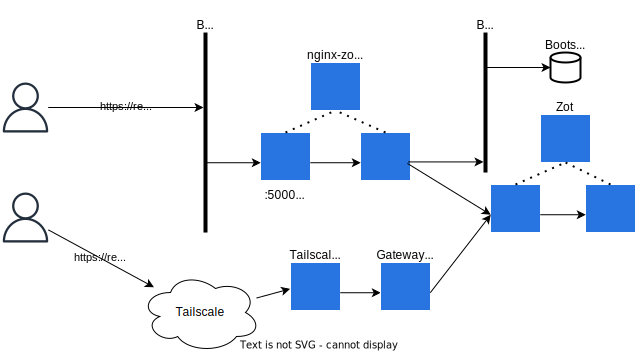

# Ring 0

## Metal as a Service

This solution is provided by Tinkerbell.

### Building before installing

The MaaS system starts the machines using an in-memory Linuxkit-based operating system called HookOS. In order to provide these artifacts using the repository, we need to build and copy them.

1. Clone the Github repository.
2. Build the artifacts.
3. Copy from the forge to the bootstrap instance using our workstation as buffer.

### Populating the private registry

Each functionnality (the core installation or any ring1 deployment) requires some OCI images to work. This is why some scripts are run, using `skopeo`. The syncing process keeps the ptahs but changes the hostname of the repository.

For example:  `quay.io/tinkerbell/actions/image2disk:latest` becomes `registry.ring0:5000/tinkerbell/actions/image2disk:latest`.

### Publishing both artifacts and images

Two services are exposed on the netboot network: the assets from the bootstrap service and the registry.

On the local network, a reverse proxy is used. A floating IP is attached using Cilium.
On the SDN, the `Service` object, part of the Zot deployment, is annotated and published using Tailscale.

### Testing the deployment using a fake machine

A local virtual instance is created on the headnode and its related `Hardware` object is created. The netboot sequence is catched by the MaaS service and a dummy workflow is performed.
