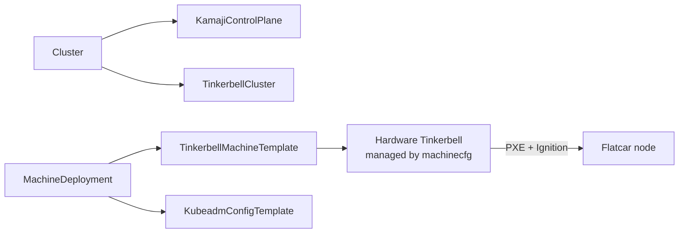

# Deploying Kubernetes on bare metal using Flatcar Linux, Kamaji, Tinkerbell and Cluster API

This deployment provisions physical machines via Tinkerbell (PXE + Ignition) and creates a
Kamaji `TenantControlPlane`. Hardware inventory is sourced from Netbox.

The CNI is **Cilium**. Workers run **Flatcar Linux** and are registered automatically via CAPI + CAPT.

```console
task: Available tasks for this project:
* populate-registry:            Add some OCI images into the registry
* populate-extensions:          Add Kubernetes extension files to the assets service
* create-machinecfg:            Create machinecfg OCI image and push it into our private registry
* create-hardwares-from-netbox: Use machinecfg to extract data and write Hardware objects
* create-capi-hardware:         Create the Hardware cluster using CAPI and CAPT
```



## Required environment variables

| Variable | Description |
| --- | --- |
| `NETBOX_ENDPOINT` | Netbox API URL |
| `NETBOX_TOKEN` | Netbox API token |
| `SITES` | Netbox site(s) to query |
| `NAMESPACE` | Kubernetes namespace for the cluster |
| `CLUSTER_NAME` | Name of the cluster |
| `CP_HOST` | Control plane IP address |
| `MACHINE_POOL` | CAPI machine pool name |
| `NETBOX_TENANT` | Netbox tenant used to filter hardware |
| `NETBOX_MODEL` | Netbox device model used to filter hardware |
| `OIDC_URL` | OIDC issuer URL for kube-apiserver |
| `OIDC_CLIENT_ID` | OIDC client ID for kube-apiserver |
| `INSTANCE_MANAGEMENT_SERVICES_IPADDR_CIDR` | Management network CIDR (ring0) |

Ring 0 artifacts must also be present: `ring0/dist/talosconfig` and `ring0/dist/bundle.crt`.

## Initialize the service

```bash
task populate-extensions
task populate-registry
task create-machinecfg
```

## Register hardware from Netbox

```bash
export NETBOX_ENDPOINT=https://netbox.example.com NETBOX_TOKEN=... SITES=my-site
task create-hardwares-from-netbox
```

## Create the cluster

```bash
task create-capi-hardware
```

The kubeconfig is written to `dist/$CLUSTER_NAME.kubeconfig`.
